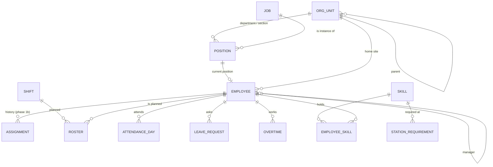

# HR-System — الخريطة الكاملة، نموذج البيانات، الوحدات، وخطة التطوير

تاريخ: 2026-09-27. الحالة: **المرحلة 1 (سجل الموظفين والهيكل) والمرحلة 2 (الأمان والاسترجاع، `docs/HR_SECURITY.md`) منفذتان ومختبرتان؛ المرحلة 2.5 (منتج قابل للتثبيت، `docs/HR_DELIVERY.md`) قيد الإغلاق؛ المرحلة 3 لم تبدأ.**
الرواتب: **تصميم معماري فقط، لا تنفيذ.**

---

## 1. أين نحن فعلًا (بدون مبالغة)

| موجود ومُختبر (المُرحّل من Department-automation) | غير موجود بعد |
|---|---|
| استيراد الحضور اليومي من Excel ودمجه بـ`Attendance_ID`، منع تكرار الملف، التراجع، لوحة مؤشرات | سجل موظفين مستقل (الموظف كان مجرد **إثراء** لصفوف الحضور) |
| إثراء الحضور بالموظف (الحالة، تاريخ التعيين) | الهيكل التنظيمي (شركة، موقع، إدارة، قسم، وظائف، مناصب) |
| ربط جدول العامل اليومي (Roster) بالحضور بمفتاح موظف+تاريخ | تعريفات ورديات وتكليفات مستقلة عن الحضور |
| ربط الإجازة (معتمدة وغير ملغاة) بأيام الحضور | العمل الإضافي كطلب/اعتماد |
| نشر `eco.employee.v1` و`eco.attendance_day.v1` للتصنيع | المهارات، التدريب، التأهيل للمحطات |
| | مستخدمين وصلاحيات (أي حد على الجهاز يفتح البرنامج) — **اتبنت في المرحلة 2** |
| | الرواتب |

**تحديث 2026-09-27:** الجدول أعلاه يصف لحظة الترحيل. من العمود الثاني اتبنى بعدها سجل الموظفين والهيكل التنظيمي (المرحلة 1) والمستخدمين والصلاحيات (المرحلة 2). الحالة الحالية المفحوصة آليًا في `STATUS.md`.

**خط الرجوع الآمن:** البرنامج المُرحّل يبقى كما هو (`engine.py` و`calculation_engine.py` مقفولان) باختباراته
الأصلية واختبار التكافؤ (صفر فروق). كل ما يلي **يُبنى بجواره**، لا فوقه.

---

## 2. الخريطة الكاملة لنظام الموارد البشرية (المصدر: قاموس البيانات بـ14 مجالًا)

| # | المجال (ملف القاموس) | الوحدة | الحالة | المرحلة |
|---|---|---|---|---|
| 1 | التنظيم والمصنع (`01_Organization_Factory`) | `org` | **يُبنى الآن** | 1 |
| 2 | البيانات الرئيسية للموظف (`02_Employee_Master`) — بيانات التوظيف فقط | `employees` | **يُبنى الآن** | 1 |
| 2b | البيانات الشخصية، الهوية، الطوارئ، المُعالين (`EMP_02/06/07/08`) | `personal` | مؤجل (حساسة؛ تشفير وصلاحيات أولًا) | بعد المستخدمين |
| 3 | الورديات والجداول والتكليفات والإضافي (`06_Shifts_Overtime`) | `shifts`, `overtime` | مُخطط | 3 |
| 4 | الوقت والحضور والإجازات (`05_Time_Attendance_Leave`) | `attendance` (المُرحّل)، `leave` | موجود جزئيًا؛ الربط بالموظف الرسمي في المرحلة 4 | 4 |
| 5 | المهارات وتخصيص العمال (`07_Skills_Worker_Allocation`) | `skills` | مُخطط — **يستخدمه التصنيع لمنع غير المؤهل** | 5 |
| 6 | التعلم والتطوير (`09_Learning_Development`) | `training` | مُخطط | 5 |
| 7 | الرواتب والتعويضات (`08_Payroll_Compensation`) | `payroll` | **تصميم فقط** (§6) | 6 |
| 8 | تخطيط القوى العاملة (`03_Workforce_Planning`) | `planning` | لاحقًا | — |
| 9 | التوظيف والتعيين (`04_Recruitment_Onboarding`) | `recruitment` | لاحقًا | — |
| 10 | الأداء والمواهب (`10_Performance_Talent`) | `performance` | لاحقًا | — |
| 11 | علاقات العمل والامتثال (`11_Employee_Relations_Compliance`) | `relations` | لاحقًا | — |
| 12 | الصحة والسلامة (`12_Health_Safety_Services`) | `safety` | لاحقًا | — |
| 13 | إنهاء الخدمة (`13_Separation_Offboarding`) | `separation` | لاحقًا | — |
| 14 | سجل الرقابة (`14_Control_History`) | في النواة: السجل الدائم والتدقيق | النواة | 1 |

---

## 3. نموذج البيانات (المراحل 1–5)



### الهيكل التنظيمي — شجرة واحدة بأنواع محددة
`ORG_UNIT(type)`: **company → site → [business_unit] → department → section**

| النوع | أبوه المسموح | مصدره في القاموس |
|---|---|---|
| `company` | لا أب (واحدة لكل تركيب؛ هويتها = معرف الشركة في المنظومة) | الإعداد |
| `site` | company | `ORG_01_Plants` |
| `business_unit` (اختياري) | site | `ORG_02_BusinessUnits` |
| `department` | business_unit أو site | `ORG_03_Departments` |
| `section` | department | `ORG_04_Sections` |

`JOB` كتالوج مسميات وظيفية (`ORG_06_Jobs`). `POSITION` = وظيفة × إدارة/قسم (`ORG_07_Positions`).
`EMPLOYEE` (`EMP_01_EmployeeMaster`): الرقم، الاسم المفضل، الاسم القانوني، حالة التوظيف، نوع العامل، التعيين/الإنهاء،
موقع الأساس، المنصب الحالي، المدير. **لا بيانات شخصية** في هذه المرحلة.

### قواعد لا تُكسر
- رقم الموظف فريد **ولا يُعاد استخدامه** حتى بعد الإنهاء أو الحذف الناعم.
- الحذف ناعم دائمًا (سلة محذوفات)؛ لا حذف لوحدة تنظيمية لها أبناء أو موظفون نشطون.
- كل حفظ = سطر في سجل دائم إضافة-فقط بسلسلة Hash (الصيغة الموحدة ADR-026)، مع من/متى/ليه.
- تحقق تفاؤلي بالإصدار: الحفظ على نسخة قديمة يُرفض.
- **الغياب عن ملف الاستيراد لا يعني الحذف** (نفس قاعدة البرنامج الأصلي).
- مرجع مكسور (إدارة تشير لوحدة أعمال غير موجودة) = **يُستورد مع تحذير ظاهر**، لا يُرفض الملف كله ولا يُخمَّن.
- الهوية العالمية: `UUIDv5(company, "hr:<type>:<code>")` — نفس ما يستخدمه التصنيع.

---

## 4. الوحدات والإصدارات (ميكانو بنفس فلسفة ميزان)

```
            ┌──────────── وحدات اختيارية ────────────────────────────────┐
            │ attendance*  leave  shifts  overtime  skills  training  payroll(تصميم) │
            ├──────────── النواة (دايمًا) ───────────────────────────────┤
            │ company + org + employees + journal + audit + eco publisher │
            └──────────────────────────────────────────────────────────────┘
   * attendance = البرنامج المُرحّل كما هو (محرك مقفول)، يُعامل كوحدة
```

| الإصدار | الوحدات | لمين |
|---|---|---|
| **الحضور فقط** | kernel + attendance | مصنع عايز يعرف مين حضر |
| **الحضور + الإجازات** | kernel + attendance + leave | + متابعة الإجازات |
| **الكامل** | الكل (عدا payroll حتى يُنفذ) | — |

تعريف الوحدة (`hr_core/modules.py`): `id`, `depends_on`, `tables_prefix`, `status` (built / planned / design_only).
اختبار يتحقق: كل إصدار يحل اعتمادياته، ولا وحدة `design_only` تدخل إصدارًا يُباع. **ملاحظة صادقة:** إيقاف `leave` داخل
المحرك المُرحّل يكون بإعداد `PROJECT.json` (بدون تعديل المحرك)؛ تطبيق الإصدار على المحرك يأتي بقرار مستقل.

---

## 5. ما نأخذه من BAMS (مرجع معماري؛ نفس اللغة Python — إعادة تنفيذ، لا نسخ)
| النمط | متى في HR |
|---|---|
| سجل دائم بصيغة موحدة + تحقق السلسلة | **المرحلة 1 (الآن)** |
| إصدار تفاؤلي `ver`، حذف ناعم وسلة، تدقيق من/متى | **المرحلة 1 (الآن)** |
| فصل القواعد: `hr.db` (أعمال) / `hr_journal.db` (دائم) / `history.db` (الحضور المُرحّل، بلا تغيير) | **المرحلة 1 (الآن)** |
| هوية جهاز + توقيع Ed25519 للسجل | **المرحلة 2 (منفذة)** — المكتبة القياسية أولًا، وملف BAMS كما هو احتياطيًا (ADR-HR-002) |
| مستخدمين، ملفات صلاحيات، قفل، سجل أمان | **المرحلة 2 (منفذة)**؛ الروابط الشخصية للعامل لاحقًا مع أول شاشة للعامل |
| نسخ احتياطي متحقق + قرص ثانٍ + **اختبار استعادة آلي** | **المرحلة 2 (منفذة)** |
| تعدد أجهزة بـfold حتمي و"To decide" (للبيانات الأساسية فقط) | بعد المرحلة 5 |

---

## 6. الرواتب — تصميم معماري فقط (لا تنفيذ قبل استقرار الموظف والحضور والإجازات والإضافي)

```
 HR-System (المالك)                                              Mizan (الدفاتر)
 ─────────────────                                               ───────────────
 عناصر الأجر (أساسي، بدلات، خصومات)  ┐
 الحضور المعتمد + الإجازات + الإضافي   ├─► تشغيل رواتب لفترة ─► نتيجة لكل موظف (تبقى في HR، سرية)
 قواعد (جداول، شرائح، معاملات)         ┘            │
                                                   └─► ملخص محاسبي للفترة ─► hr.payroll_period.v1 ─► قيد واحد
                                                        (إجماليات لكل مركز تكلفة × حساب:          (مصروف رواتب، مساهمات،
                                                         رواتب، مساهمات صاحب العمل،                 استقطاعات مستحقة،
                                                         استقطاعات، صافي مستحق) — بلا أسماء         صافي مستحق للدفع)
```
- **لا حقيقتين:** HR يحسب ولا يرحّل قيودًا؛ ميزان يقيّد ولا يحسب ولا يخزن موظفين.
- الفترة تُقفل في HR قبل الإرسال؛ التصحيح = فترة تسوية جديدة، لا تعديل فترة مُرسلة.
- معرّف كل ملخص = UUIDv5 من (الشركة، الفترة، رقم التشغيل) → الإرسال المكرر لا يُرحّل مرتين (نفس نموذج `eco:<event-id>` مع ميزان).
- مراكز التكلفة: كود المركز من HR (`Default_Cost_Center_ID`) يُطابق حسابات/مراكز ميزان عبر جدول ربط في الموصل.

---

## 7. خطة التطوير (كل مرحلة ببوابة خروج)

| المرحلة | المحتوى | بوابة الخروج |
|---|---|---|
| **1 (منفذة)** | النواة: الشركة، الهيكل التنظيمي، الوظائف، المناصب، سجل الموظفين المستقل، السجل الدائم، التدقيق، الاستيراد من Excel، الناشر يأخذ الموظف من السجل | اختبارات السجل؛ الاختبارات الأصلية + التكافؤ بصفر فروق؛ اختبار التصنيع الحقيقي يمر |
| **2 (منفذة)** | المستخدمين والصلاحيات، هوية الجهاز والتوقيع، النسخ الاحتياطي واختبار الاستعادة | `TEST_HR_SECURITY.py` (٧٧ فحصًا) + ٢٨ طفرة ممسوكة — `docs/HR_SECURITY.md` |
| 2.5 | تحويل النظام لمنتج واحد قابل للتثبيت: ملف تثبيت ويندوز واحد، خادم واحد ودخول واحد (الحضور المقفول خلفه)، البيانات خارج مجلد البرنامج، هوية الشركة من مالكها، تحديث بنسخة احتياطية متحققة ورجوع آمن، شاشات عربي/إنجليزي — `docs/HR_DELIVERY.md` | تثبيت من الصفر بدون بايثون وبدون إنترنت؛ المدير والدخول؛ السجل؛ الصلاحيات؛ الحضور بنفس الأرقام؛ النسخ والبروفة والاستعادة؛ إعادة التشغيل؛ التحديث فوق نسخة؛ الفشل وقطع الكهرباء أثناء التحديث؛ كل الاختبارات؛ اختبار التصنيع الحقيقي |
| 2.6 | واجهة المنتج (مرحلة UX بأمر المالك): هيكل تطبيق واحد من مجموعة الواجهة الموحدة للمنظومة (نسخة GMES بدون تعديل وببصمة)، لوحة، موظفين بشروط بحث وجدول وتفاصيل، الهيكل، الوظائف، المناصب، الحضور، المستخدمين، الصلاحيات، التدقيق، النسخ، حالة النظام، الإعدادات؛ عربي/إنجليزي؛ فاتح/داكن — `docs/ux/visual-acceptance.md` | اعتماد المالك للشكل بعد مقارنته بصور G-MES الحقيقية؛ كل الاختبارات والطفرات |
| 3 | الورديات والجداول والتكليفات مستقلة عن الحضور | الجدول يوجد قبل الحضور؛ الحضور يُطابق مع الجدول |
| 4 | الحضور والإجازات والإضافي مربوطة بالموظف الرسمي (الموظف غير المسجل = تحذير) | الربط بالسجل لا بملف الموظف المرفوع |
| 5 | المهارات والتدريب وتأهيل المحطة/الماكينة + عقد للتصنيع | التصنيع يرفض عاملًا غير مؤهل (اختبار من البداية للنهاية) |
| 6 | الرواتب (بعد استقرار 1–5) | فترة تجريبية تطابق حسابًا يدويًا؛ قيد ميزان متوازن |

## ملحق — الانضباط والجزاءات (المرحلة 6، منفذة 2026-09-28 بأمر المالك)
- **لائحة الجزاءات** (`penalty_rule`): المخالفة (تأخير، انصراف مبكر، غياب، عدم تسجيل، مخالفة سلوكية)، من كم دقيقة تُحتسب،
  نافذة التكرار بالأيام، والجزاء لكل مرة (`warning,deduct:0.25,...`؛ الأخير يتكرر). اللائحة ملك الشركة وتُعتمد كما يشترط القانون.
- **المخالفة** (`violation`، الكود `<الموظف>-<التاريخ>-<البند>`): تُقترح من الأيام المخططة مقابل الحضور (لا يوم إجازة ولا راحة
  ولا عطلة، ولا تُقترح مرتين) أو تُسجل يدويًا؛ ثم يُبت فيها مرة واحدة بحق منفصل `hr.discipline.approve` (الفصل بين المهام).
- **حدود القانون المطبقة** (تُراجع مع المستشار القانوني): 5 أيام خصم للمخالفة الواحدة و5 أيام في الشهر، القرار خلال 30 يومًا من
  اكتشاف المخالفة (بعدها الحفظ فقط)، تحقيق مكتوب لأكثر من يوم أو للإحالة، القرار نهائي ولا يُحذف.
- **لا مال:** الجزاء أيام فقط؛ تحويل الأيام إلى مبلغ عمل الرواتب (تصميم فقط)، وميزان يسجل القيد.
- الكود: `hr_core/discipline.py`؛ الاختبار: `TEST_HR_DISCIPLINE.py`؛ نسخة البيانات 3.
